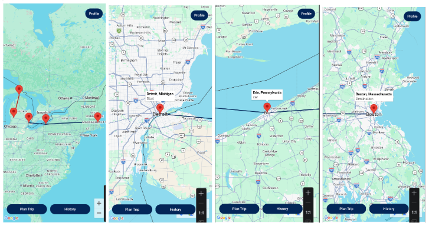
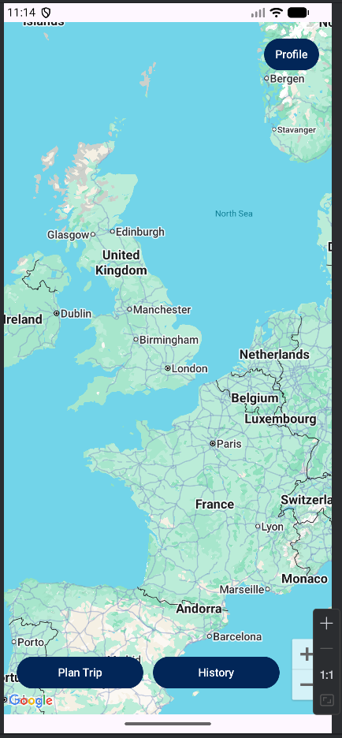
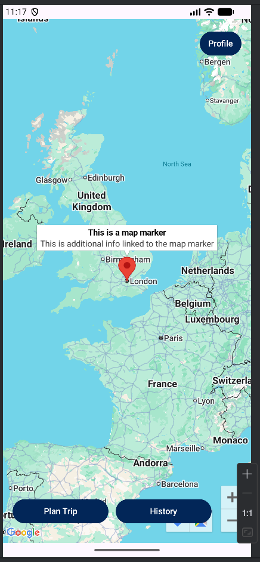
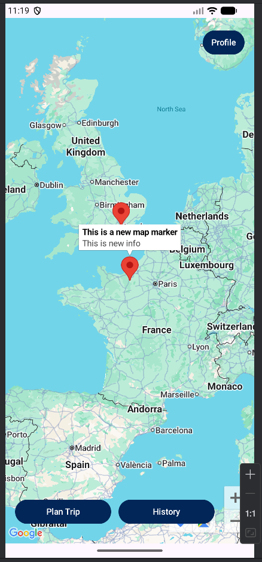
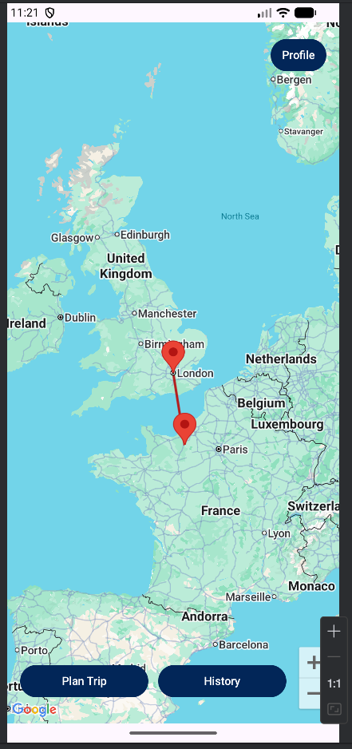
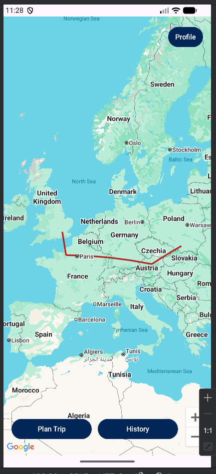
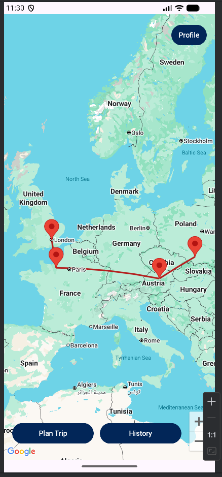

## Deliverables
Video Presentation:
[https://github.com/user-attachments/assets/225b7616-4300-428d-bb5d-e5b5f7e7c51c](https://github.com/user-attachments/assets/225b7616-4300-428d-bb5d-e5b5f7e7c51c)

Google Slides:
[https://docs.google.com/presentation/d/11XCr4z0bKy36VVCYg71JKb6yKYFh-yDyKHWTJKKDcDw/edit?usp=sharing](https://docs.google.com/presentation/d/11XCr4z0bKy36VVCYg71JKb6yKYFh-yDyKHWTJKKDcDw/edit?usp=sharing)

# Maps SDK tutorial

## Overview
Maps SDK is an android library that gives the ability to use map API in your application. Such 
features include map interaction, location markers, and polylines to connect points on the map. 
With this demo, you can create Trips, which are connected with different stops with the location 
markers, and are visually connected with the polyline. Here are visuals of the different location 
markers we will implement.




## Getting Started
First, you will need to add the following lines to your Top-level build.gradle.kts plugins:
```kotlin
plugins {
    id("com.google.android.libraries.mapsplatform.secrets-gradle-plugin") version "2.0.1" apply false
    id("com.google.gms.google-services") version "4.4.4" apply false
}
```

Then you will need to add the following lines to app-level build.gradle.kts dependencies:
```kotlin
dependancies {
    implementation("com.google.maps.android:maps-compose:4.4.1")
    implementation("com.google.android.gms:play-services-maps:19.0.0")
}
```

In AndroidManifest.xml add the following user permissions:
```xml
    <uses-permission android:name="android.permission.INTERNET" />
    <uses-permission android:name="android.permission.ACCESS_NETWORK_STATE" />
```

Then add the following lines in the application field:
```xml
    <appication>
        <meta-data
            android:name="com.google.android.gms.version"
            android:value="@integer/google_play_services_version" />
        <meta-data
            android:name="com.google.android.geo.API_KEY"
            android:value="${MAPS_API_KEY}" />
    </appication>
```

You should then get get an API key from Google Maps Platform, details on how to obtain the Key can 
seen under the setup tab "Set up the Maps SDK for Android." You can find a link to the page in the 
See Also section of the tutorial.

Finally set up your API key from Google Maps Platform into your local.properties file:
```
MAPS_API_KEY=(API_KEY_HERE)
```

Once this is set up you should now be able to use the map features.

## Step-by-Step Coding Instructions
Create a composable function called MapScreen in the file you want to use the map in
```kotlin
@Composable
fun MapScreen() {
}
```

This will be called on in the main screen function to control the area of displaying the map

In the MapScreen function add the following lines:
```kotlin
val defaultPosition = LatLng(51.5074, -0.1278)
val cameraPositionState = rememberCameraPositionState {
    position = CameraPosition.fromLatLngZoom(defaultPosition, 5f)
}
```
This sets the camera to a specific spot when the map loads in, you can change the coordinates to
another set of coordinates if you prefer. To change the zoom level, set 5f to a lower number to zoom out
or a higher number to zoom in.

Now add:
```kotlin
GoogleMap(
    modifier = Modifier.fillMaxSize(),
    cameraPositionState = cameraPositionState
) {
    
}
```
This will call the API to display the map in the UI.

In your main screen function add:
```kotlin
@Composable
fun MainScreen() {
    Box(modifier = Modifier.fillMaxSize()) {
        MapScreen()
    }
}
```

try running the app, you should be able to see the map on the screen. make sure the map UI is formated
the way that best suits your needs.



To add a marker to the map, add a Marker function call to the GoogleMap Block:
```kotlin
    Marker(
        state = MarkerState(position = defaultPosition),
        title = "This is a map marker",
        snippet = "This is additional info linked to the map marker"
    )
```
The state is the LatLng data you want the marker to be located at, the title will be the name that pops up
when you click the marker, and the snippet is additional information located under the title. If you
run the app, you should now see a marker on the map.



Let's try drawing a line between 2 markers, make an additional marker on the map. For example:
```kotlin
    Marker(
    state = MarkerState(position = secondPosition),
    title = "This is a new map marker",
    snippet = "This is new info"
    )
```
Where secondPosition is a new val with LatLng data.



Now you should use the PolyLine function call:
```kotlin
    Polyline(
        points = listOf(defaultPosition, secondPosition),
        color = Color(180, 30, 30),
        width = 8f,
        geodesic = true
    )
```
In this function, points is the list of locations you want to connect, color controls the color of the
line, width controls the line width, and geodesic makes the lines straight in context with the map.

Running the app should show the new line.



While this is fine with just 2 points, adding multiple points will connect all points with a line, 
we only want to connect neighboring points in the list. Try making a list of points:
```kotlin
val firstTrip = listOf(point_one, point_two, point_three, point_four)
```
Where each point has LatLng data

Then add this around the Polyline function call:
```kotlin
    firstTrip.zipWithNext { a, b ->
        Polyline(
            points = listOf(a, b),
            color = Color(180, 30, 30),
            width = 8f,
            geodesic = true
        )
    }
```
Make sure to change the list of points to a and b in the function call. This will make a trail from
the starting location to the ending location. 



If we want the markers to also display each point, we can change the marker function call to:
```kotlin
        firstTrip.forEach { location ->
            Marker(
                state = MarkerState(position = location),
                title = "First Trip",
                snippet = "This was a fun trip"
            )
        }
```
Running the app will now show the markers as well as the lines on the map



In your view model, you may want to add a function to return LatLng data when given an address. To 
do so, add this function outside of your viewmodel:
```kotlin
fun getLatLngFromAddress(context: Context, address: String?): LatLng? {
    if (address == null) { return null }
    val geocoder = Geocoder(context, Locale.getDefault())
    val results = geocoder.getFromLocationName(address, 1)
    return if (!results.isNullOrEmpty()) {
        LatLng(results[0].latitude, results[0].longitude)
    } else null
}
```
This will return a LatLng object if the provided address is valid, such as "London, UK" or "1 Campus 
Dr, Allandale MI 49401". If the address is invalid or null, it will return null.


## Further Discussion and Conclusions

In this tutorial, we implement the Maps SDK library into and android application. Whit this library,
we are able to add an interactive map, place detailed markers, and connect these markers as a trail without
connecting all markers. We also discussed how to convert string into LatLng data and implement into
our application. Maps SDK is a convenient way for implementing native API into android applications.
However, alternative map features are also available to implement into your such as
Mapbox, HERE Technologies, and TomTom. Each give their own unique features for customization and accessibility.
Our source code that uses Maps SDK can be found on this link https://github.com/synjinshanley/TravelTracker-app/tree/main

## See Also
Set up API key:
[https://developers.google.com/maps/documentation/android-sdk/get-api-key](https://developers.google.com/maps/documentation/android-sdk/get-api-key)

Learn how to implement map features:
[https://developers.google.com/maps/documentation/android-sdk/map](https://developers.google.com/maps/documentation/android-sdk/map)

Mapbox:
[https://www.mapbox.com/](https://www.mapbox.com/)

Here Technologies:
[https://www.here.com/platform/geocoding](https://www.here.com/platform/geocoding)

TomTom:
[https://www.tomtom.com/](https://www.tomtom.com/)